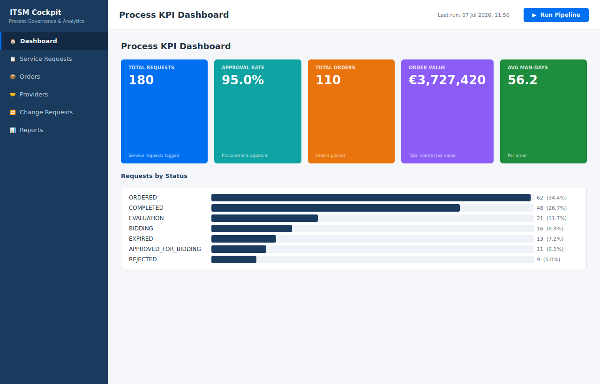
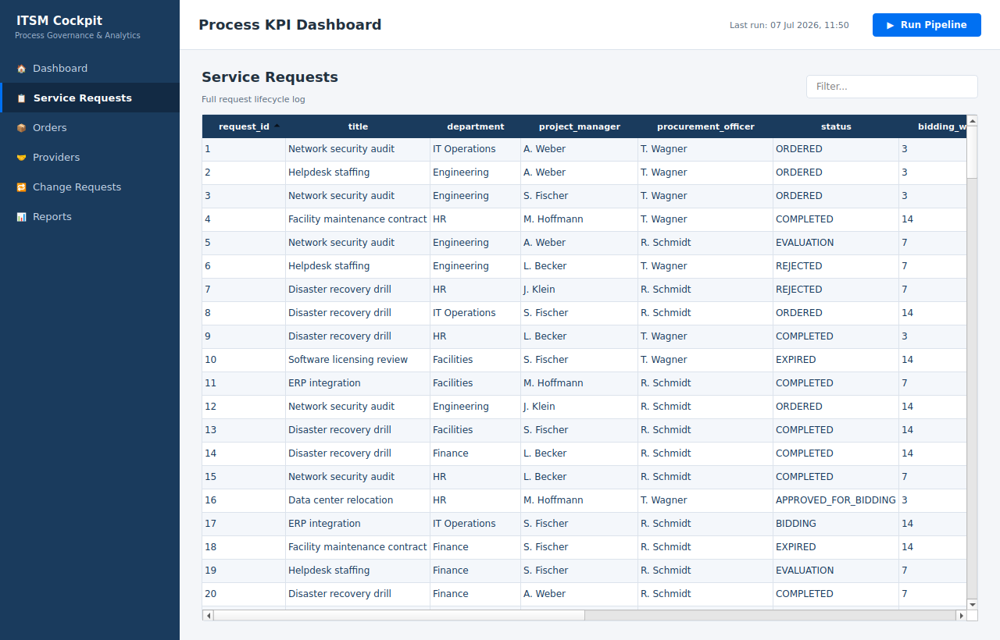
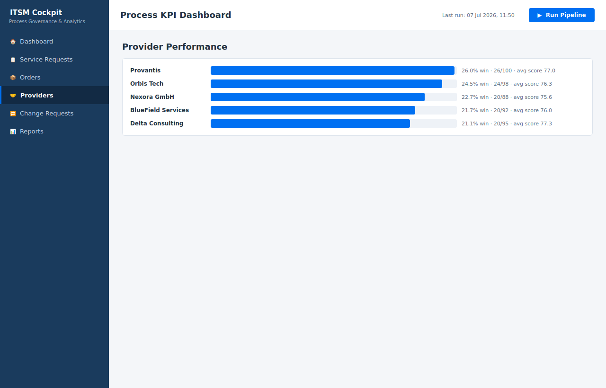
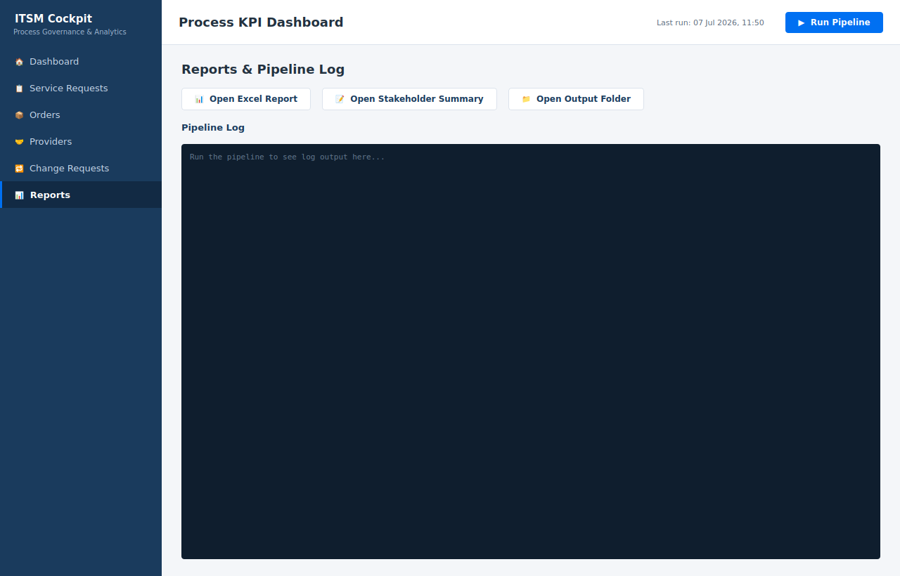

# IT Process Analytics & Governance Cockpit


A Python analytics and process-governance layer built on top of **[ServiceManagementSystem](https://github.com/BidhanPaul/ServiceManagementSystem)** — a Spring Boot backend that runs an IT service-request lifecycle from intake through procurement approval, provider bidding, offer evaluation, order placement, and post-order changes.

Where the Spring Boot system **executes** the process, this project **monitors and reports on it** — the way a real IT process-governance function would: tracking KPIs, flagging control deviations, and producing stakeholder-ready outputs (Excel dashboards, narrative summaries, and a desktop cockpit).

<p align="center">
  
</p>

---

## Table of contents

- [Why this exists](#why-this-exists)
- [Process modeled](#process-modeled)
- [Architecture](#architecture)
- [Features](#features)
- [Screenshots](#screenshots)
- [Data source — how ingestion actually works](#data-source--how-ingestion-actually-works)
- [Installation](#installation)
- [Usage](#usage)
- [Project structure](#project-structure)
- [Tech stack](#tech-stack)
- [Known limitations](#known-limitations)
- [Roadmap](#roadmap)
- [License](#license)

---

## Why this exists

Financial and enterprise IT organizations don't just *run* processes — they have to **prove** the process is under control: who approved what, how long each stage took, where SLAs were breached, which vendors perform best. That governance layer is usually a mix of spreadsheets, dashboards, and manual follow-up.

This project builds that layer for a real system end-to-end: ingest → warehouse → KPI computation → polished Excel report → plain-language stakeholder summary → a lightweight desktop UI to run it all without touching the command line.

---

## Process modeled

```
Request created
      │
      ▼
Procurement review & approval   ◄── control gate, SLA-tracked
      │
      ▼
Provider bidding window          ◄── integration point (external providers)
      │
      ▼
Offer evaluation                 ◄── scored by Resource Planner
      │
      ▼
Order placement & approval       ◄── control gate
      │
      ▼
Order changes (substitution / extension)   ◄── post-order control
```

Every arrow corresponds to something the analytics layer actually measures: cycle time between stages, approval/rejection rate at each gate, and deviations from expected SLAs.

---

## Architecture

```
┌──────────────┐     ┌──────────────┐     ┌──────────────┐     ┌──────────────┐
│  Ingestion   │ ──► │   SQLite     │ ──► │  Analytics   │ ──► │   Outputs    │
│              │     │  Warehouse   │     │ (Pandas/SQL) │     │              │
│ REST API or  │     │              │     │              │     │ • Excel      │
│ synthetic    │     │ 5 normalized │     │ KPIs, cycle  │     │ • Markdown   │
│ generator    │     │ tables       │     │ time, SLA    │     │   summary    │
└──────────────┘     └──────────────┘     │ breaches     │     └──────────────┘
                                            └──────────────┘
                                                   ▲
                                                   │
                                        ┌──────────────────────┐
                                        │   Desktop Cockpit     │
                                        │   (PySide6, SAP-style)│
                                        │   "Run Pipeline"       │
                                        │   button drives the    │
                                        │   whole flow above      │
                                        └──────────────────────┘
```

---

## Features

**Ingestion & storage**
- Live REST ingestion (`requests`) with real error handling, or a synthetic fallback matching the exact production schema
- Normalized SQLite warehouse: `service_requests`, `offers`, `evaluations`, `orders`, `order_changes`

**Analytics** (`analytics.py` — Pandas + SQL)
- Request status breakdown & procurement approval rate
- Stage-by-stage cycle time (review→approval, bidding duration, evaluation→order, order approval)
- Provider win rate & average evaluation score
- Order-change (substitution/extension) frequency and resolution time
- SLA breach detection
- Monthly volume trend, department breakdown

**Excel report** (`excel_report.py` — openpyxl)
- Navy cover sheet with quick-glance stat chips
- KPI Dashboard: icon-tagged colored tiles, styled pie/line charts, a process-health panel — all driven by **live formulas** (`COUNTIF`, `SUBTOTAL`, `AVERAGE`, `SUM`), nothing hardcoded
- Raw data sheets as banded Excel Tables with real date/currency formatting
- Conditional formatting: data bars on prices/values, a red→yellow→green color scale + traffic-light icons on evaluation scores
- Color-coded sheet tabs
- Dedicated Provider Performance sheet with its own win-rate bar chart

**Stakeholder summary** (`summary_generator.py`)
- Plain-language Markdown write-up: headline metrics, cycle-time callouts, control deviations, provider performance, recommended follow-ups

**Desktop cockpit** (`desktop_app/` — PySide6)
- SAP Fiori-inspired UI: dark navy sidebar, icon navigation
- KPI tiles + status bars on the dashboard
- Sortable, filterable data tables (Service Requests, Orders, Change Requests)
- Provider win-rate leaderboard
- **Run Pipeline** button — re-executes the whole flow in a background thread (non-blocking), live log + progress bar, auto-refreshes every screen on completion

---

## Screenshots

| Dashboard | Service Requests |
|---|---|
|  |  |

| Providers | Reports & Pipeline Log |
|---|---|
|  |  |

---

## Data source — how ingestion actually works

**Live mode** (`python main.py --api-url https://your-deployment`):
Calls the real backend's public endpoints —
```
GET /api/requests
GET /api/public/offers
GET /api/public/evaluations
```
using `requests`, with real error handling (timeouts, HTTP errors, connection failures all caught and logged — see `ingestion.py`).

**Synthetic fallback** (default — used whenever no `--api-url` is given, or the live call fails):
`data_generator.py` produces data in the **exact same shape** as the real API: same fields, same status values, same relationships between requests → offers → evaluations → orders. The generator is seeded for reproducible demo runs. This is the mode used for every screenshot and report in this README.

**Known gap:** the public API doesn't currently expose `orders` or `order_changes` endpoints, so those two tables are always synthetic, even in live mode.

> **Honesty note:** the live-fetch code path is genuinely implemented (real HTTP calls, real error handling) but has not yet been run end-to-end against a continuously-deployed instance of `ServiceManagementSystem`. This README won't pretend otherwise.

---

## Installation

```bash
git clone https://github.com/BidhanPaul/Process-Documentation-Workflow-Automation.git
cd Process-Documentation-Workflow-Automation
pip install -r requirements.txt
```

Requires Python 3.10+.

---

## Usage

### Command-line pipeline
```bash
# Synthetic data (default, 180 requests)
python main.py

# Against a live ServiceManagementSystem deployment
python main.py --api-url https://your-sms-deployment.example.com --n-requests 250
```

Outputs land in `output/`:
- `process.db` — SQLite warehouse
- `IT_Process_KPI_Report.xlsx` — KPI dashboard + raw data
- `stakeholder_summary.md` — narrative summary

### Desktop cockpit
```bash
cd desktop_app
python app.py
```
On launch it loads whatever is already in `output/process.db` (if present). Click **Run Pipeline** in the top bar to (re)generate everything and refresh the UI — no command line needed after that.

---

## Project structure

```
.
├── main.py                    # Orchestrator (CLI entry point)
├── data_generator.py          # Synthetic dataset matching the real API schema
├── ingestion.py                # Live REST fetch + synthetic fallback
├── database.py                  # SQLite schema + load helpers
├── analytics.py                  # Pandas/SQL KPI computations
├── excel_report.py                # Excel workbook builder (live formulas)
├── summary_generator.py            # Markdown stakeholder summary
├── requirements.txt
├── desktop_app/
│   ├── app.py                       # Desktop entry point
│   ├── main_window.py                # SAP-style UI shell
│   ├── theme.py                       # QSS stylesheet
│   ├── pandas_model.py                 # DataFrame → Qt table model
│   ├── data_service.py                  # Loads current pipeline state
│   └── pipeline_worker.py                # Background thread runner
├── docs/
│   └── screenshots/
└── output/                        # Generated on each run (git-ignored)
```

---

## Tech stack

Python · Pandas · SQLite/SQL · `requests` (REST ingestion) · openpyxl (Excel with live formulas) · PySide6/Qt (desktop UI)

---

## Known limitations

- Orders/order-change data is always synthetic (no public endpoint exposed yet on the backend)
- Live-mode ingestion has not been run against a continuously deployed backend instance
- No automated test suite yet (manual verification via formula recalculation checks)
- Desktop app has no packaged executable — run from source

---

## Roadmap

- [ ] Add authenticated endpoints for orders/order-changes so live mode is fully real
- [ ] Package the desktop app with PyInstaller
- [ ] Add pytest coverage for `analytics.py`
- [ ] Optional: scheduled pipeline runs (cron / GitHub Actions) with report artifacts

---

## License

MIT — see [LICENSE](LICENSE).
